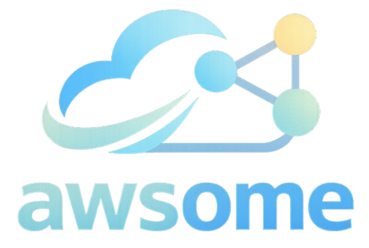

<p align="center">
  
</p>

`awsome` is a Tauri desktop app for visualizing AWS infrastructure as an interactive topology graph and turning a live snapshot into an editable architecture plan.

It uses a lightweight Vite + React frontend and a native Rust backend. The Rust backend reads the selected local AWS profile, fetches live resources with the AWS SDK for Rust, transforms them into graph data, and returns it to the Cytoscape UI through a Tauri command.

## What It Shows

- VPCs
- Subnets
- EC2 instances
- RDS instances
- Security groups
- Internet gateways
- NAT gateways
- Route tables and their effective subnet associations/routes
- VPC gateway and interface endpoints
- VPC peering connections
- Egress-only internet gateways
- Transit Gateways, attachments, route tables, and discovered route paths
- Application Load Balancers
- Network Load Balancers
- Load-balancer target groups, health-check configuration, and registered EC2, IP, Lambda, and ALB targets

awsome also includes a Planning mode for arranging AWS services on a manual architecture canvas without changing live infrastructure.

## Planning Architectures

Open **Planning mode** from the top navigation. Planning documents support:

- In-place renaming from the title above the canvas
- Automatic local saving of services, connections, sizes, positions, and the current zoom/pan
- Automatic restoration when Planning mode is opened again
- A local architecture library for switching between multiple saved designs
- Undo/redo controls and keyboard shortcuts for recovering autosaved edits
- Direct removal of services and individual connections
- Editable labels on each connection, carried into saved JSON and diagram exports
- Shareable, self-contained SVG diagram exports in addition to the editable JSON export
- **New architecture**, **Import**, **Export**, and confirmed **Delete** controls

Imported files are validated against the AWS service catalog, and an invalid or incompatible file is left unopened with an explanation in the UI. Importing a document whose id already exists asks before replacing that saved architecture. Deleting an architecture also requires confirmation.

Planning data is stored only on the current device in the app webview's local storage. The library uses a versioned index with one storage entry per architecture and safely imports the older `graphivo.planning.last-document` save without deleting it. JSON files use the versioned `graphivo/planning-document` schema for backward compatibility. Version 1 includes the document id and name, timestamps, nodes (`serviceKey`, custom name, position, size, and optional live-resource provenance), edges, and canvas viewport. If saved local data is corrupt or incompatible, awsome isolates unreadable entries and leaves valid architectures available.

## Stack

- Tauri 2
- Rust
- Vite
- React
- Cytoscape
- AWS SDK for Rust

## How It Works

1. Tauri loads the Vite-built React frontend in a native desktop window.
2. The UI calls Tauri's typed `fetch_topology` command.
3. Rust loads the selected AWS profile and region from local AWS shared configuration.
4. The Rust command follows every AWS pagination token, fetches load-balancer target registrations with bounded concurrency, and builds nodes and defensible network relationships from the regional inventory.
5. Cytoscape renders the result and the UI exposes selected-resource details.

If an AWS inventory API is unavailable—for example because the selected profile lacks permission—awsome keeps the successfully discovered resources, marks the map as incomplete, and lists the affected inventories in the UI. Internal inventory-task failures still fail the request safely.

## Live topology to architecture plan

1. In **Live mode**, choose an AWS profile and region and load the topology.
2. After the load succeeds, select **Open in planning**.
3. awsome creates a deterministic, editable layout containing the discovered network resources, load balancers, target groups, registered targets, and their directed relationships.
4. Select an imported node to inspect its original resource label, resource ID, live type, profile, region, and import provenance. Its planning display name, size, and position can be changed without changing the saved live snapshot.
5. Add services from the planning library or create additional connections to explore the desired “to-be” architecture.

If the planning canvas already contains work, awsome asks whether to append the snapshot, replace the canvas, or cancel. Append preserves existing planning work and skips resources and relationships that were already imported, so importing the same snapshot again does not create duplicates.

## Development

Install dependencies:

```bash
npm install
```

Run the Tauri desktop app in development:

```bash
npm run start
```

This starts Vite on port `5173` and launches the Tauri desktop window against it.

## Production Flow

Create a production desktop bundle:

```bash
npm run build
```

To only build the static frontend:

```bash
npm run build:web
```

Tauri packages the Vite build from `dist/` inside the native application; it does not start a local Node.js server in production.

## AWS Usage

The app expects AWS credentials to be available on the local machine through AWS shared config/credentials files, using a profile name such as `default`.

You can choose:

- AWS profile
- AWS region

Then load the live topology from the app UI.

Live mode is read-only. It makes regional inventory calls and does not create, update, or delete AWS resources. VPC, subnet, EC2, security-group, RDS, gateway, endpoint, peering, Transit Gateway, route-table, and ELBv2 inventory is fully paginated so large accounts are not silently truncated.

For large inventories, use **Find resource** to search resource names, IDs, types, and returned details. The resource chips above the graph can also narrow the visible topology by service type; the result count makes the active subset clear.

Inside the live topology canvas, use the mouse wheel to zoom around the pointer, drag the background to pan, and drag a resource toward any canvas edge to automatically reveal more workspace in that direction. The fit button restores the complete topology to view.

## Project Structure

```text
src/                         Vite + React UI
src/planningDocument.mjs     Planning schema, validation, migration, and storage
public/assets/               AWS service assets used by the UI
src-tauri/                   Tauri configuration and Rust AWS topology command
```

## Notes

- There is no Electron, Next.js, or Node.js AWS backend in the app runtime.
- Planning changes are local architecture-design edits; awsome does not apply them to AWS.
- Returning to Live mode restores the loaded topology independently of planning changes.
- Edges are emitted only when both endpoint resources were discovered. Subnets without an explicit route-table association are connected to the VPC's main route table because that is the effective AWS routing behavior.
- Route targets are shown only when their endpoint was discovered, so the graph does not emit dangling connections. This includes internet gateways, NAT gateways, EC2 instances, VPC endpoints, peering connections, egress-only internet gateways, and Transit Gateways.
- ELBv2 discovery currently visualizes Application and Network Load Balancers. Gateway Load Balancers are outside the supported-resource set.
- Load-balancer paths are shown as load balancer → target group → registered target. Target registrations include target type, protocol/port, availability zone, and returned health state/reason where AWS provides them. Listener and rule routing are not represented yet.
