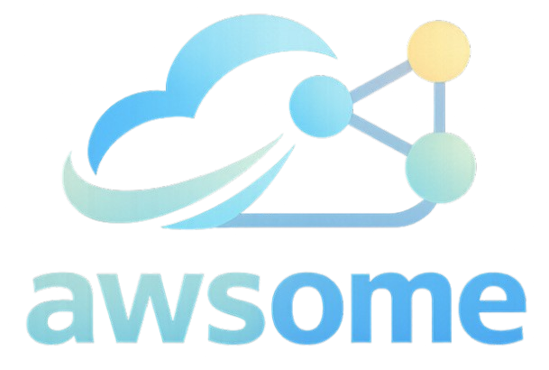

<p align="center">
  
</p>

# awsome

awsome is a Linux desktop app for inspecting regional AWS network inventory and sketching architecture plans. Live scans use read-only AWS APIs. Changes made in Planning mode stay on this device and are never applied to AWS.

The app uses an Electron shell, a Vite and React interface, and a Rust companion process. The Rust process reads the selected AWS profile, collects inventory, and returns graph data to the interface. Cytoscape renders the live topology.

## Live topology

Choose an AWS profile and up to 50 regions, then load a topology. At most three regions are scanned at once. Search matches resource names, IDs, types, and returned details. Service-type and region filters narrow the graph without resetting its pan or zoom. Use the mouse wheel to zoom around the pointer, drag empty canvas space to pan, drag a resource toward a canvas edge to reveal more space, and use **Fit** to show the full graph. Short connection captions appear where they fit; hover over or select a connection to read its full label.

### Inventory coverage

Live discovery is limited to the regional resources below; it is not a complete inventory of every AWS service.

- **EC2 network inventory:** VPCs, subnets, EC2 instances, security groups, internet gateways, NAT gateways, egress-only internet gateways, gateway and interface VPC endpoints, VPC peering connections, route tables, Transit Gateways, Transit Gateway attachments and route tables, and discovered Transit Gateway routes.
- **RDS:** DB instances. The app does not query RDS cluster-level inventory.
- **Elastic Load Balancing v2:** Application and Network Load Balancers, listeners, listener default actions, custom rules and conditions, target groups, health-check settings, and registered instance, IP, Lambda, or ALB targets. Gateway Load Balancers are not included.

Relationships are derived from the returned configuration inventory; they do not represent observed traffic or test reachability. An edge is emitted only when both endpoint resources are present. A subnet without an explicit route-table association is associated with its VPC's main route table. Route paths through load balancers are shown as load balancer → listener → rule → target group → target; only forward actions create target-group routing edges.

If an inventory call fails, awsome keeps the resources it did discover and marks the affected inventory as incomplete. Successful regions remain available when another region fails. Comparisons omit scopes that were incomplete in either scan, so missing inventory is not counted as a confirmed deletion. A region whose primary inventory calls all fail is marked failed. If every selected region fails, the scan returns an error instead of an empty graph. After a failed refresh, the last successful graph remains visible with a previous-snapshot warning.

### Saved scans

Successful scans are saved on the device. **Saved scans** can reopen a scan without AWS access, compare it with the displayed topology, or delete it after confirmation. Refreshing the same profile and region set compares the result with the most recent saved scan for that source.

The **Storage** control shows saved-scan disk use and previews the exact files that cleanup would remove. Cleanup keeps the selected number of newest scans per profile and region set, and rechecks the candidate list before deleting. Snapshot files contain resource inventory and metadata; protect the app data directory accordingly.

## Planning mode

Planning mode is a local architecture editor. Add services from the AWS service library, move and resize nodes, draw directed connections, and add connection labels. Changes do not alter live scans or AWS resources. Undo and redo are available for planning edits.

Planning documents autosave on this device and restore when the app starts. They include node names, positions, sizes, connections and their labels, and canvas zoom and pan. The architecture library supports multiple documents. Import and export use JSON documents with the `graphivo/planning-document` schema, version 1; **Export SVG** creates a self-contained diagram.

To make a plan from a scan, load a topology in Live mode and select **Open in planning**. If the planning canvas already contains work, choose to append the scan, replace the canvas, or cancel. Append skips resources and relationships already imported from the same source. Imported nodes retain their source resource, profile, region, and provenance; editing their plan names or positions does not change the saved scan.

Invalid or unsupported JSON imports are rejected with an explanation. Importing a document whose ID already exists asks before replacing it. Deleting a saved architecture requires confirmation.

## AWS profiles and permissions

awsome lists profile names from the shared AWS config and credentials files. By default, it reads `~/.aws/config` and `~/.aws/credentials`; set `AWS_CONFIG_FILE` or `AWS_SHARED_CREDENTIALS_FILE` to use different files. The selected profile is passed to the AWS SDK for Rust. Live scans require credentials and read access for the selected profile. Planning mode and previously saved scans do not require AWS access.

The backend currently calls these AWS API operations:

- **EC2:** `DescribeRegions`, `DescribeVpcs`, `DescribeSubnets`, `DescribeInstances`, `DescribeSecurityGroups`, `DescribeInternetGateways`, `DescribeNatGateways`, `DescribeRouteTables`, `DescribeVpcEndpoints`, `DescribeVpcPeeringConnections`, `DescribeEgressOnlyInternetGateways`, `DescribeTransitGateways`, `DescribeTransitGatewayAttachments`, `DescribeTransitGatewayRouteTables`, and `SearchTransitGatewayRoutes`.
- **RDS:** `DescribeDBInstances`.
- **Elastic Load Balancing v2:** `DescribeLoadBalancers`, `DescribeTargetGroups`, `DescribeListeners`, `DescribeRules`, and `DescribeTargetHealth`.

The region picker is populated from regions returned by `DescribeRegions`. If the profile has no configured region, awsome uses `us-east-1` for that lookup. You can type a region code if the lookup is unavailable. Scans call AWS only for inventory; awsome does not create, update, or delete AWS resources.

## Local data

- Planning documents are stored in the Electron webview's local storage, inside the app's user-data directory. The library uses a versioned index and a separate entry for each architecture. The app can import the earlier `graphivo.planning.last-document` save without removing it.
- Scan snapshots and their summaries are stored as JSON in the app's data directory. On Linux, the default directory is `~/.local/share/com.basil.awsome.electron`, or `$XDG_DATA_HOME/com.basil.awsome.electron` when `XDG_DATA_HOME` is set.
- On first launch, Electron imports valid scans and planning documents from the previous Tauri installation. It leaves the original data in place, keeps an existing Electron entry when IDs conflict, and reports entries it cannot import.

If planning data is corrupt or incompatible, awsome isolates the unreadable entries and keeps valid architectures available. Export important plans as JSON backups.

## Development

Build from source with Node.js and npm, plus Rust stable and Cargo. The GitHub Actions workflow currently uses Node.js 22, Rust stable, and Ubuntu 22.04.

```bash
npm ci
npm run start
```

`npm run start` builds the Rust development companion, starts Vite on port `5173`, and opens the Electron app.

To build only the frontend, run `npm run build:web`. To create the production desktop package, run:

```bash
npm run build
```

The production build currently targets a Linux Debian package (`.deb`) and writes it under `release/`. It packages the Vite build and Rust companion; it does not start a development server.

### Checks

```bash
npm test
CARGO_TARGET_DIR=src-tauri/target CARGO_BUILD_JOBS=1 cargo test --manifest-path native/Cargo.toml --release --locked
cargo fmt --manifest-path native/Cargo.toml --all -- --check
```

The ignored live inventory smoke test requires read-only AWS access and at least two regions. Example using the `default` profile:

```bash
AWSOME_SMOKE_REGIONS=ap-southeast-1,ap-southeast-2 \
CARGO_TARGET_DIR=src-tauri/target \
cargo test --manifest-path native/Cargo.toml --locked tests::live_multi_region_inventory_smoke -- --ignored
```

Set `AWSOME_SMOKE_PROFILE` to use a different local profile. GitHub Actions runs the Node and Rust tests, checks Rust formatting, builds the `.deb`, opens the installed app in a virtual display, and uploads the package as a workflow artifact.

## Project layout

```text
src/                         Vite + React interface and planning logic
native/                      Rust AWS inventory and snapshot backend
electron/                    Electron main process and preload bridge
public/assets/               AWS service assets
src-tauri/                   Legacy Tauri sources and Rust build target directory
```

## License

awsome is licensed under the [MIT License](LICENSE).
